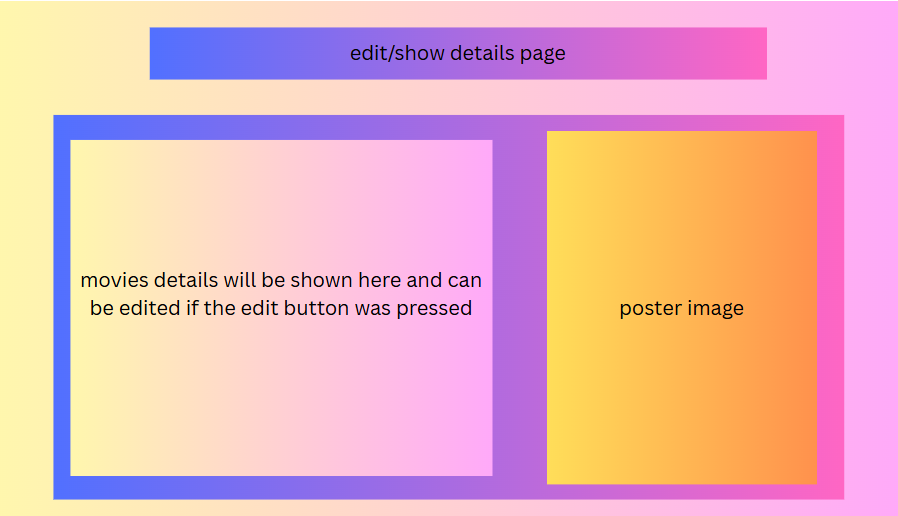
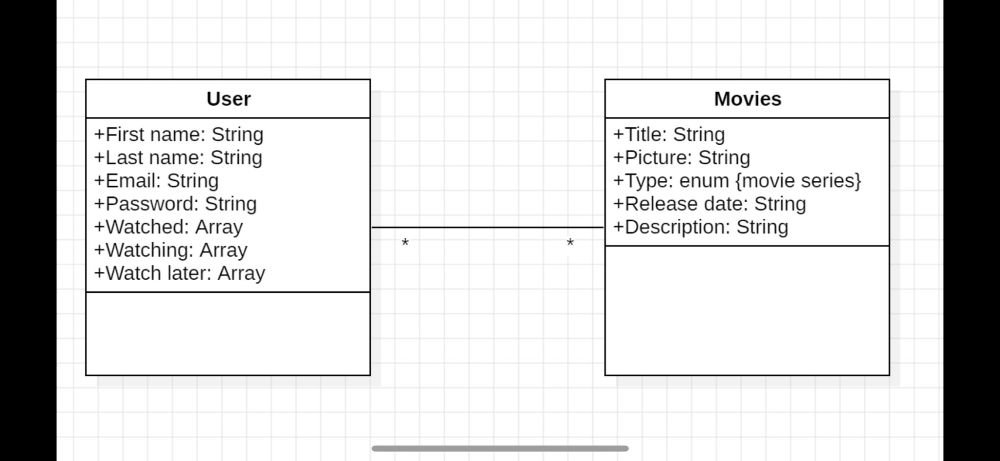
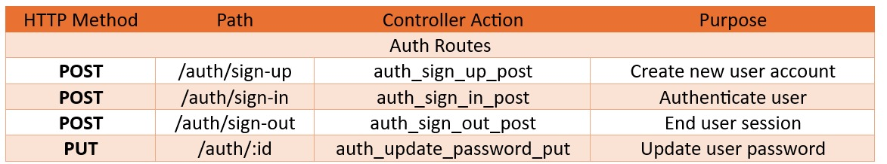
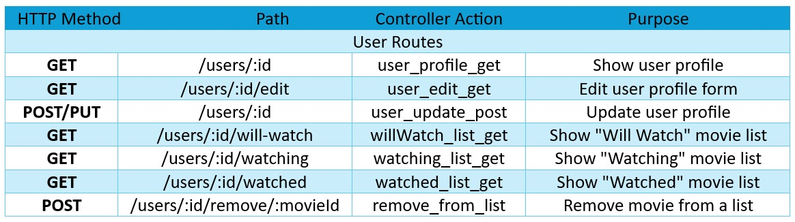
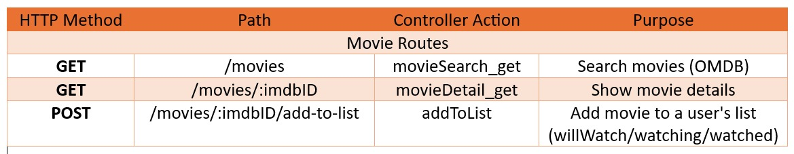
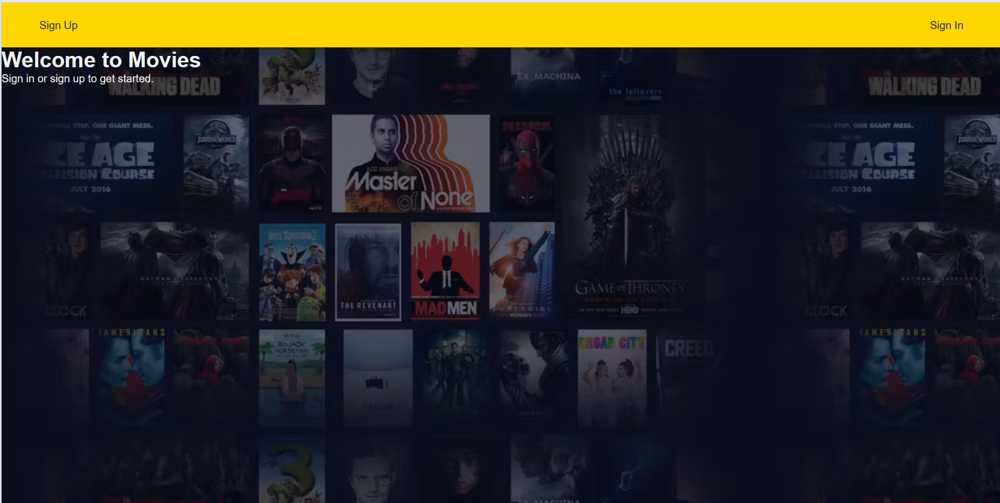
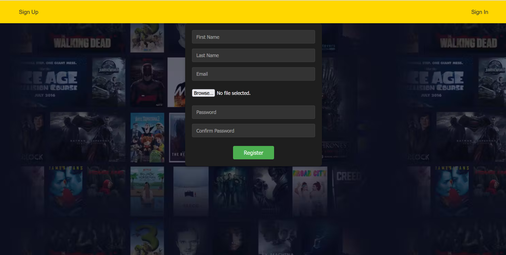
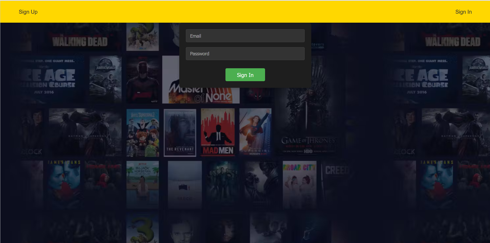

# Movie List Website
# Date 7/17/2025
# By: Mohammed Rashed , Abdulla Zaid , Manaf  Hujairi
# A brief Description of Project
A website user can organize their list of movies and tv series by adding them to different categories, like watched, watching, and plan to watch. and the user can update their password, the image of their profile and the user should register for the website to use it. The user can register for the web by inserting a username, email address, and password

# Getting Started

1. Planning by Drawing 

# Wireframes Design

# ERD Design

# RESTful Table

# Screenshot Design

The user can sign in or sign up if they don't have an account 

The user creates a new account to use the website

User signs in by their account 

The user can edit the information and update the password

The user can search for a movie and add it to one of the lists if they log in

The user can drop down a menu to choose a list to add a movie

The user's list of movies

# Lists/Tech used

- html
- JavaScript
- express
- ejs
- mongodb-mongoose

# source /reference/attributions
- [API's Serach](https://www.omdbapi.com)
- [API's actors image](https://en.wikipedia.org/api/)
- [Background image](https://ph-files.imgix.net/ef79fb5e-2dcf-42c5-8e73-238facd68376.png?auto=compress&codec=mozjpeg&cs=strip&auto=format&w=569&h=320&fit=max&frame=1&dpr=2)
