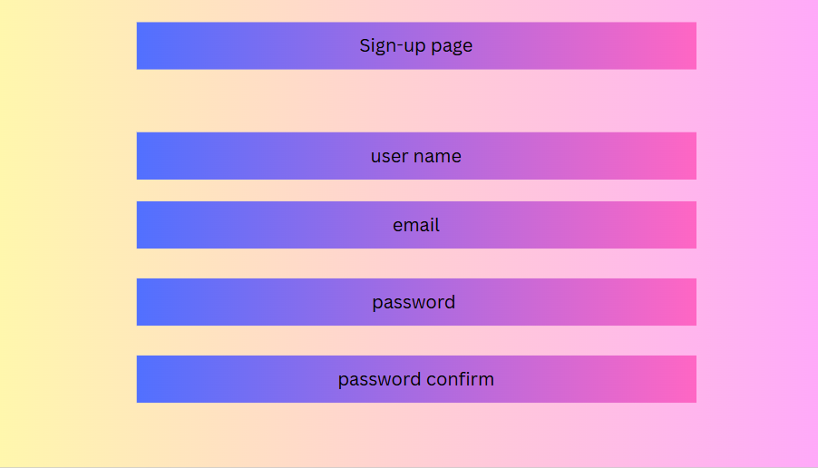
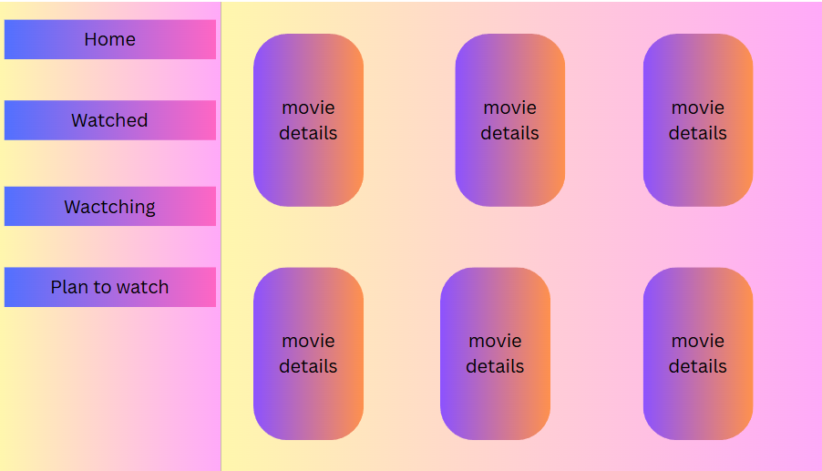

# Project Title [ Movie List Website]
# Date 7/17/2025
# By: Mohammed Rashed , Abdulla Zaid , Manaf  Hujairi
# A brief Description of Project
A website user can organize their list of movies and tv series by adding them to different categories, like watched, watching, and plan to watch. and the user can update their password, the image of their profile and the user should register for the website to use it. The user can register for the web by inserting a username, email address, and password

# Getting Started

1. Planning by Drawing 

# Wireframes/Screenshot Design

# Pseudo-code for website

# Lists/Tech used

- VS Code for Editing
- html
- JavaScript
- express
- ejs
- mongodb-mongoose

# source /reference/attributions

